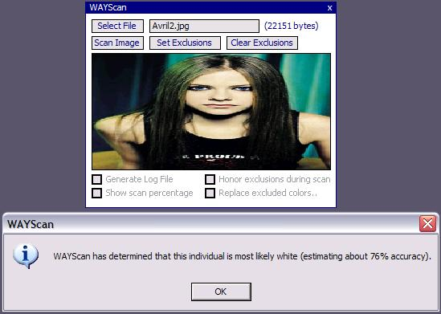



## WAYScan

### Description

Scans an image and attempts to determine whether the individual in the picture is black or white. It also attempts to return the accuracy of the results, based upon the black/white ratio of colors it found.
 
### More Info
 

             |
---                |---
**Submitted On**   |2004-06-21 03:38:42
**By**             |[JuiCe\.](https://github.com/Planet-Source-Code/PSCIndex/blob/master/ByAuthor/juice.md)
**Level**          |Intermediate
**User Rating**    |3.5 (14 globes from 4 users)
**Compatibility**  |VB 6\.0
**Category**       |[Complete Applications](https://github.com/Planet-Source-Code/PSCIndex/blob/master/ByCategory/complete-applications__1-27.md)
**World**          |[Visual Basic](https://github.com/Planet-Source-Code/PSCIndex/blob/master/ByWorld/visual-basic.md)
**Archive File**   |[WAYScan1759976212004\.zip](https://github.com/Planet-Source-Code/juice-wayscan__1-54516/archive/master.zip)

